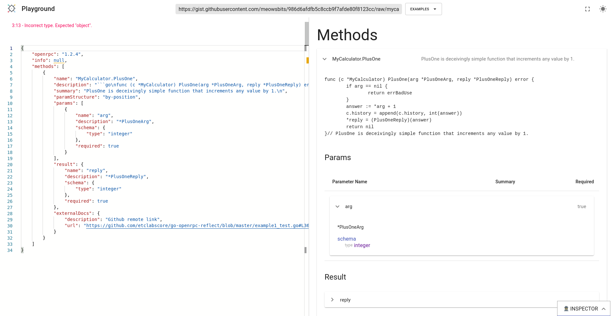

# go-openrpc-reflect

Use reflection to generate OpenRPC service descriptions from static code and at runtime.

:construction: __WARNING__ This is a work in progress, and is being actively developed.
Not recommended yet for production use.


- [GoDocs](https://pkg.go.dev/mod/github.com/etclabscore/go-openrpc-reflect)

## Theory

Go's `net/rpc` service works by using a code-style convention
to structure a reflection-based implementation to build RPC servers around business logic.

This package works in a similar way, but instead of building RPC servers, it builds service descriptions
(of those servers) which meet the [OpenRPC Specification](https://spec.open-rpc.org/). Differentially, this package
doesn't strictly enforce any specific code-style conventions, but provides a (hopefully) extensible pattern
that can be moulded to fit nearly any RPC service implementation, whether hand-rolled or conventional. (Relatively) sane defaults
are provided fitting the conventions of the most popular Go RPC libraries.

This is intended to open the door to OpenRPC adoption -- and service discovery patterns in general -- by removing the 
hurdle of requiring a human to actually sit down and write (and maintain) a complete and correct description of
potentially complex services.

It enables APIs to provide accurate, complete, _and dynamic_ descriptions of themselves
which can adapt to varying permissions and visibility scopes, potentially numerous and diverse server businesses, 
and different transport contexts.

## Example

This example is taken directly from [./example1_test.go](./example1_test.go). Please peruse the other ./example\* files if you're curious.

```go
package go_openrpc_reflect

import (
	"encoding/json"
	"errors"
	"fmt"
	"log"
	"net"
	"net/http"
	"net/rpc"

	meta_schema "github.com/open-rpc/meta-schema"
)

// Set up a basic service that does some example-application things.
type MyCalculator struct {
	history []int
}

var errBadUse = errors.New("calculator doesn't work like that")

// net/rpc is sort of funny because it has these special conventions that you have
// to follow if you want to register receivers to net/rpc servers.
// These are conventions such as:
// - must be a method on a pointer receiver
// - must have two arguments
// - arguments must each be pointers
// - ... etc.
// Because these conventions are kind of funny, people often just use wrappers that fit
// these conventions around their 'actual' methods.
// But for the sake of brevity, which I'm probably close to losing anyways, we're just
// going go for the bone.

// PlusOneArg is an integer that will be incremented by one.
type PlusOneArg int

// PlusOneReply is an integer that will be one greater than the argument.
type PlusOneReply int

// PlusOne is deceivingly simple function that increments any value by 1.
func (c *MyCalculator) PlusOne(arg *PlusOneArg, reply *PlusOneReply) error {
	if arg == nil {
		return errBadUse
	}
	answer := *arg + 1
	c.history = append(c.history, int(answer))
	*reply = (PlusOneReply)(answer)
	return nil
}

// ExampleDocument_DiscoverStandard demonstrates a basic application implementation
// of the OpenRPC document service.
func ExampleDocument_DiscoverStandard() {
	calculatorRPCService := new(MyCalculator)

	// Assign a new standard lib rpc server.
	server := rpc.NewServer()
	
	// Set up a listener for our standard lib rpc server.
	// Listen to TPC connections on any open port.
	listener, err := net.Listen("tcp", "127.0.0.1:0")
	if err != nil {
		log.Fatal("Listener:", err)
	}

	go func() {
		defer listener.Close()
		log.Printf("Serving RPC server on port %s", listener.Addr().String())

		// Start accept incoming HTTP connections
		err = http.Serve(listener, server)
		if err != nil {
			log.Fatal("Serve:", err)
		}
	}()

	// Instantiate our document with sane defaults.
	doc := &Document{}

	// Set up some minimum-viable application-specific information.
	// These are 3 fields grouped as 'Meta' in the case are server and application-specific data
	// that depend entirely on application context.
	// These fields are filled functionally, and Servers uses a lambda.
	// The fields are:
	// - Servers: describes server information like address, protocol, etc.
	// - Info: describes title, license, links, etc.
	// - ExternalDocs: links to document-level external docs.
	// This is the only place you really have to get your hands dirty.
	// Note that Servers and Info fields aren't strictly-speaking allowed to be nil for
	// an OpenRPC document to be 'valid' by spec (they're *required*), but this is just to
	// show that these are the only things that you have to actually think about
	// and we don't really care about meeting spec in a simple example.
	doc.WithMeta(&MetaT{
		GetServersFn: func() func(listeners []net.Listener) (*meta_schema.Servers, error) {
			return func([]net.Listener) (*meta_schema.Servers, error) { return nil, nil }
		},
		GetInfoFn: func() (info *meta_schema.InfoObject) {
			return nil
		},
		GetExternalDocsFn: func() (exdocs *meta_schema.ExternalDocumentationObject) {
			return nil
		},
	})

	// Use a Standard reflector pattern.
	// This is a sane default supplied by the library which fits Go's net/rpc reflection conventions.
	// If you want, you can also roll your own, or edit pretty much any part of this standard object you want.
	// Highly tweakable.
	doc.WithReflector(StandardReflector)

	// Register our calculator service to the rpc.Server and rpc.Doc
	// I've grouped these together because in larger applications
	// multiple receivers may be registered on a single server,
	// and receiver registration is often done in a loop.
	// NOTE that net/rpc will log warnings like:
	//   > rpc.Register: method "BrokenReset" has 1 input parameters; needs exactly three'
	// This is because internal/fakemath has spurious methods for testing this package.

	err = server.Register(calculatorRPCService) // <- Register the receiver to the net/rpc server.
	if err != nil {
		log.Fatal(err)
	}
	doc.RegisterReceiver(calculatorRPCService) // <- Register the receiver to the doc.

	// Wrap the document in a very simple default 'RPC' service, which provides one method: Discover.
	// This meets the OpenRPC specification for the service discovery endpoint to be at the reserved
	// rpc.discover endpoint.
	// You can easily roll your own Discover service if you'd like to do anything tweakable or fancy or different
	// with the document endpoint.
	rpcDiscoverService := &RPC{doc}
	// (For the curious, here's what the whole of this RPC service looks like behind the scenes.)
	/*
		type RPC struct {
			Doc *Document
		}

		type RPCArg int // noop

		func (d *RPC) Discover(rpcArg *RPCArg, document *meta_schema.OpenrpcDocument) error {
			doc, err := d.Doc.Discover()
			if err != nil {
				return err
			}
			*document = *doc
			return err
		}
	*/

	// Now here's the good bit.
	// Register the OpenRPC Document service back to the rpc.Server.
	// This is registering the service description... erm, service, to the server.
	// This registers the rpc.discover endpoint on the server.
	err = server.Register(rpcDiscoverService)
	if err != nil {
		log.Fatal(err)
	}

	// Now, let's test it with a client.
	// This part would normally not be here, it would live somewhere far far way in a client land.
	// But for the sake of example.
	client, err := rpc.DialHTTP("tcp", listener.Addr().String())
	if err != nil {
		log.Fatalf("Error in dialing. %s", err)
	}
	defer client.Close()

	// First, let's make sure the calculator is calculating.
	var reply PlusOneReply
	argument := PlusOneArg(42)
	err = client.Call("MyCalculator.PlusOne", &argument, &reply)
	if err != nil {
		log.Fatal(err)
	}
	log.Println(reply)
	if reply != 43 {
		log.Fatal("wrong math!")
	}

	// Now we get to actually test that the rpc.discover endpoint is actually working!
	discoverReply := meta_schema.OpenrpcDocument{}
	err = client.Call("RPC.Discover", 0, &discoverReply)
	if err != nil {
		log.Fatal(err)
	}

	fmt.Println(*discoverReply.Openrpc)
	// Output: 1.2.4

	j, _ := json.MarshalIndent(discoverReply, "", "    ")
	log.Println(string(j))
	// TADA!
}

```

Running this Example test yields the following response:

```txt
=== RUN   ExampleDocument_DiscoverStandard
2020/05/18 18:49:24 Serving RPC server on port 127.0.0.1:40861
2020/05/18 18:49:24 43
2020/05/18 18:49:24 {
    "openrpc": "1.2.4",
    "info": null,
    "methods": [
        {
            "name": "MyCalculator.PlusOne",
            "description": "```go\nfunc (c *MyCalculator) PlusOne(arg *PlusOneArg, reply *PlusOneReply) error {\n\tif arg == nil {\n\t\treturn errBadUse\n\t}\n\tanswer := *arg + 1\n\tc.history = append(c.history, int(answer))\n\t*reply = (PlusOneReply)(answer)\n\treturn nil\n}// PlusOne is deceivingly simple function that increments any value by 1.\n\n```",
            "summary": "PlusOne is deceivingly simple function that increments any value by 1.\n",
            "paramStructure": "by-position",
            "params": [
                {
                    "name": "arg",
                    "description": "*PlusOneArg",
                    "schema": {
                        "type": "integer"
                    },
                    "required": true
                }
            ],
            "result": {
                "name": "reply",
                "description": "*PlusOneReply",
                "schema": {
                    "type": "integer"
                },
                "required": true
            },
            "externalDocs": {
                "description": "Github remote link",
                "url": "https://github.com/etclabscore/go-openrpc-reflect/blob/master/example1_test.go#L36"
            }
        }
    ]
}
--- PASS: ExampleDocument_DiscoverStandard (0.00s)
PASS

```




The generated OpenRPC service description document can be seen at the OpenRPC Playground at https://playground.open-rpc.org/?url=https://gist.githubusercontent.com/meowsbits/986d6afdfb5c8ccb9f7afde80f8123cc/raw/mycalculator.openrpc.json.

Note that the Playground will complain about an empty `info` field; we left it empty for the sake of brevity.